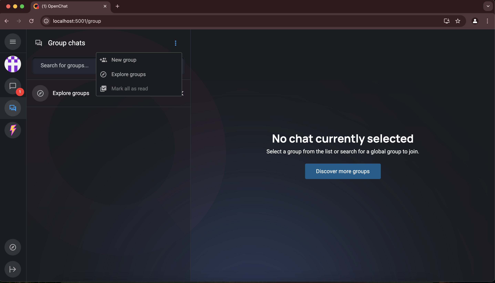
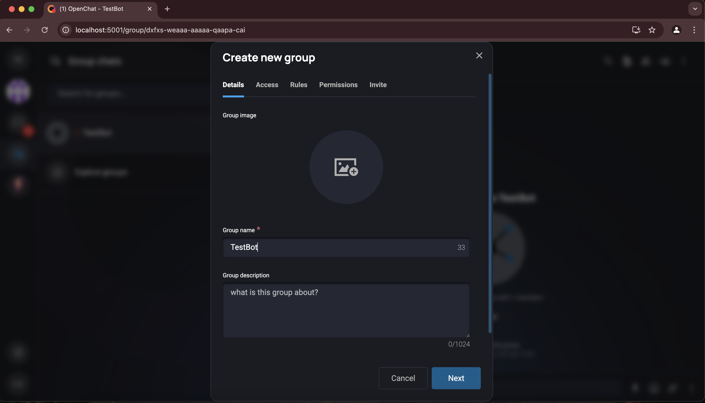
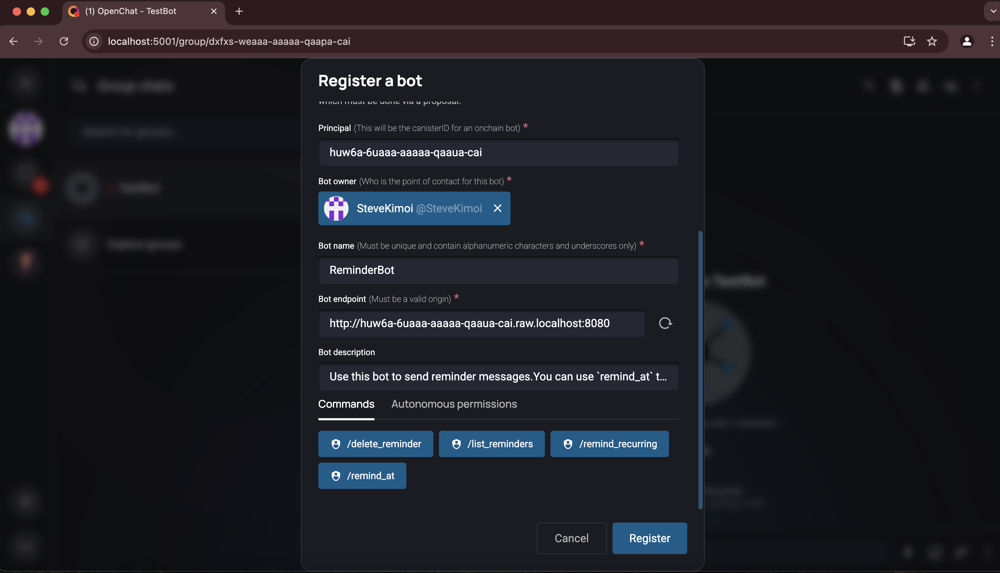
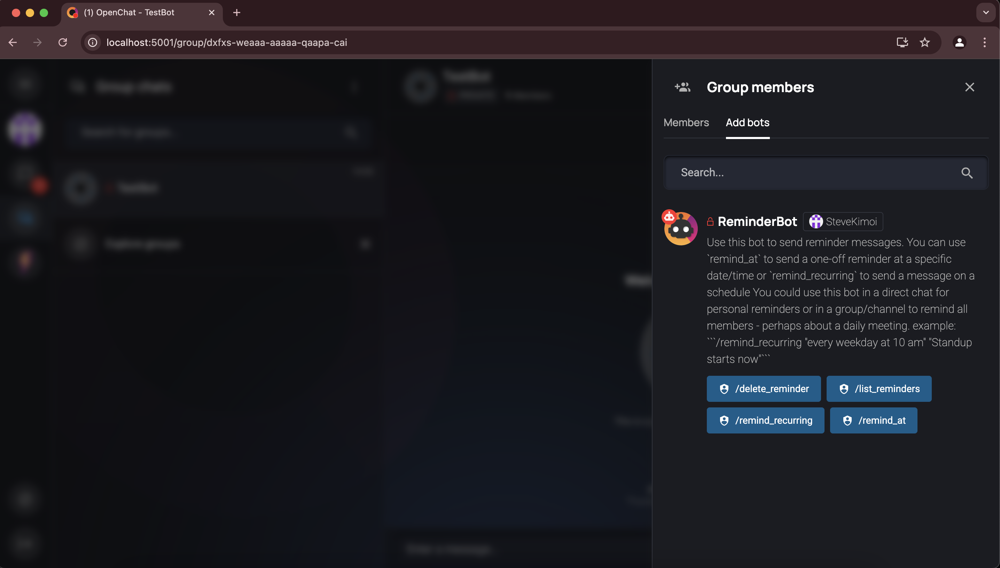
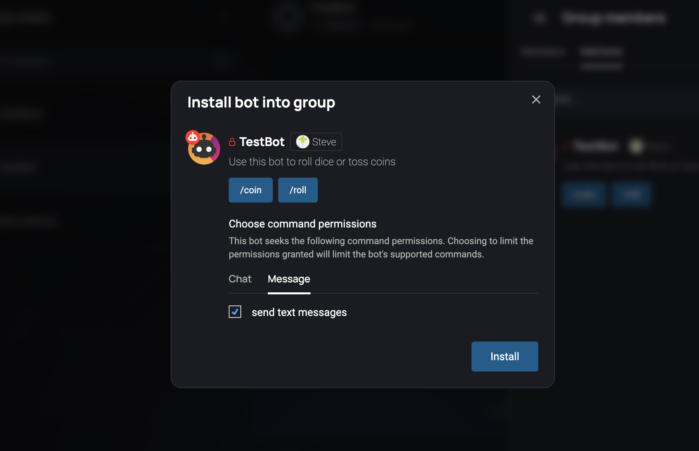

# Install and test the example bots

This is a guide to get the example bots up and running as a starting point for developing your own bot.

## Prerequisites

Ensure the `open-chat` and `open-chat-bots` repos are cloned into the same root directory:

```
open-chat-labs/
   |_open-chat
   |_open-chat-bots
```

## Step 1: Setup OpenChat Locally

1. Setup OpenChat locally by following the instructions in the [readme](https://github.com/open-chat-labs/open-chat/blob/master/README.md) of the OpenChat repo.

2. Run OpenChat in a browser with `http://localhost:5001/`

&nbsp;
After a minute or so you should see the OpenChat frontend.
&nbsp;


## Step 2: Deploy the Bots

Below you can find automated scripts or READMEs to deploy the example bots.

In each case the scripts will output the following which are needed in step 4 to register the bots with OpenChat:

```
  # example
  Name: DiceBot
  Principal: xojpk-xfq5f-kkflr-wiq6n-ihp2u-2lnwn-2r5wl-lho4l-ldv5o-n5vip-5ae
  Endpoint: http://localhost:3000
```

### Canister bots

- [GreetBot](./scripts/deploy_greet_bot.sh)

```bash
  ./scripts/deploy_greet_bot.sh
```

- [ReminderBot](./scripts/deploy_reminder_bot.sh)

```bash
  ./scripts/deploy_reminder_bot.sh
```

### Off-chain bots

The DiceBot and LlamaBot will each need to be run in a separate terminal.

- [DiceBot](./scripts/deploy_dice_bot.sh)

```bash
  ./scripts/deploy_dice_bot.sh
```

- [LlamaBot](./scripts/deploy_llama_bot.sh)

```bash
  ./scripts/deploy_llama_bot.sh
```

- [DiscordBot](./rs/offchain/examples/discord/README.md)
- [Typescript bots](./ts/README.md)

Note: the DiscordBot cannot be deployed locally because it needs to be reachable by Discord.

## Step 3: Create Account and Test Group

1. Signup and create an account

2. Create a private group for testing:

&nbsp;
Navigate to the groups section and then click "New group" from the groups menu
&nbsp;



&nbsp;
Enter the group name and just pick default settings by clicking "next" until you reach the "Create Group" button.
&nbsp;



## Step 4: Register the Bot

From your test group on the local OpenChat website enter `/register_bot` and fill in the fields

This registers the bot on OpenChat for testing but it still needs to be installed into a group, community, or as a direct chat

&nbsp;



## Step 5: Add Bot to Group

1. Open the group members in the right panel

2. Look for the "Add bots" tab



3. Select the newly registered bot and install it



&nbsp;
You can now run the various bot commands it provides!
