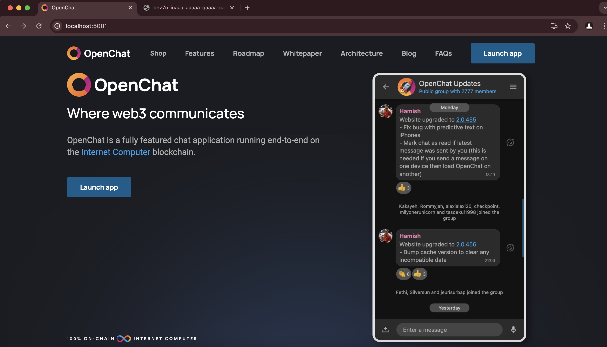
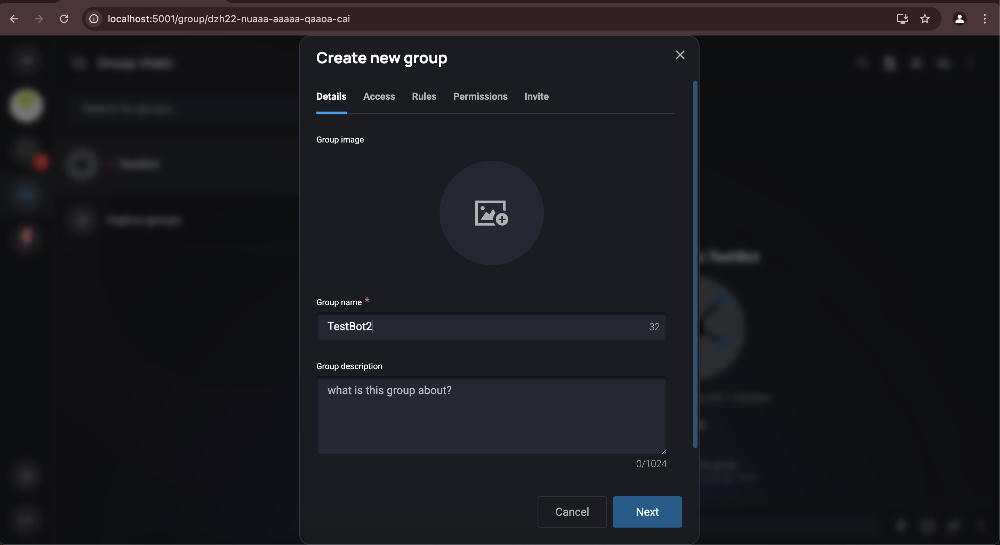
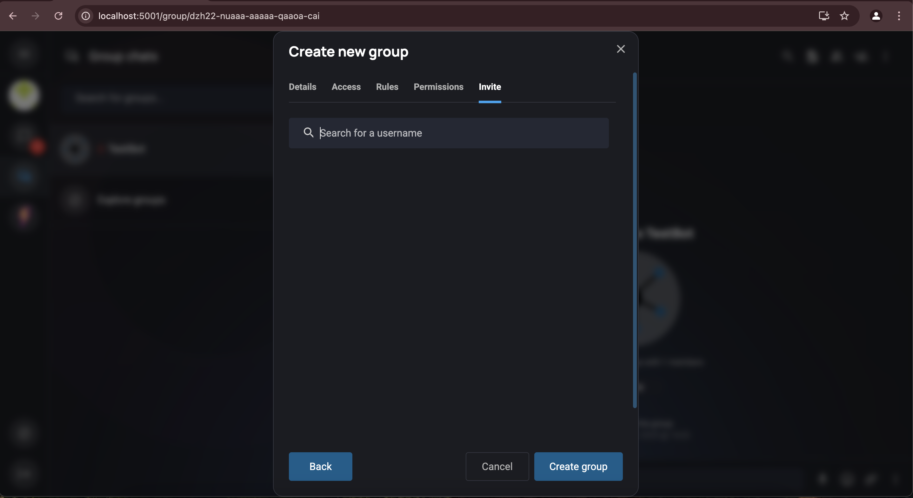

# SDK for bots built in Rust

Here you can find the base rust SDK for building OpenChat bots with concrete SDKs for canister and offchain bots in their respective folders.

## Prerequisites

Ensure `open-chat-bots` and `open-chat` are in the same root directory:

```
open-chat-repos/ 
   |_open-chat
   |_open-chat-bots
```

## Types of Bots
There are two types of bots:
1. Canister Bots (OnChain Bots)
2. Offchain Bots

## Quick start

## Section 1: Setting up and deploying a canister bot: 

### Step 1: Setup OpenChat Locally

1. Setup OpenChat locally by following the instructions in the [README](https://github.com/open-chat-labs/open-chat/blob/master/README.md)

2. Run OpenChat in a browser with `http://localhost:5001/`

You'll see the OpenChat frontend:



### Step 2: Create Account and Test Group

1. Signup and create an account

2. Create a private group for testing:
   - Click "Create a new group":
     
   - Enter the group name:
     
   - Click "next" until you reach the "Create Group" button:
     

### Step 3: Deploy the Bot

Inside the `open-chat-bots/rs` directory, run `./scripts/deploy_greet_bot.sh`. This will create a local canister, build the WASM, install it, and return the bot endpoint.

Successful deployment output example:
```bash 
Deployment complete. The greet_bot has the following endpoint:
http://gf4a7-g4aaa-aaaaa-qaarq-cai.raw.localhost:8080
```

### Step 4: Register the Bot

1. From your test group on the local OpenChat website enter `/register_bot` and fill in the fields

2. Use the bot canister id from the endpoint URL in Step 3 as the principal

3. This registers the bot on OpenChat for testing but it still needs to be installed into a group, community, or as a direct chat


### Step 5: Add Bot to Group

1. Open the group members in the right panel

2. Look for the "Add bots" tab

3. Select the newly registered bot and install it

4. You can now run the various bot commands it provides!


You can now run the various bot commands it provides!